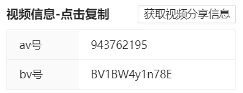

# 视频功能

## 自动循环

视频自动开启洗脑循环(切换视频同样生效)

:::tip
该功能默认关闭，想要开启此功能需要访问插件选项页，在视频设置中开启**是否自动开启洗脑循环**
:::

## 自动宽屏

视频自动开启宽屏模式

:::tip
该功能默认关闭，想要开启此功能需要访问插件选项页，在视频设置中开启**是否开启默认宽屏**
:::

## 自动展开简介

视频自动展开简介

:::tip
该功能默认关闭，想要开启此功能需要访问插件选项页，在视频设置中开启**视频简介自动展开**
:::

## 视频工具

在视频页插入工具按钮，点击可打开视频工具；自动记忆视频工具按钮位置(可以放到自己舒服的位置，无需每次调整位置)。


:::tip
该功能默认关闭，想要开启此功能需要访问插件选项页，在视频设置中开启**是否开启视频工具**，并且可以通过重置按钮重置视频工具位置
:::


视频工具功能如下：

### 视频信息展示

展示视频的av号以及bv号，点击可复制



点击右上角**获取视频分享信息**按钮可快速复制视频分享的内容，内容样例如下：

```
视频标题: xxxx
up主: xxxx
视频链接: https://www.bilibili.com/video/xxxx
```


### 视频封面获取

点击**视频封面**按钮，开启视频封面的弹出层

- 点击图片可放大预览；如需保存图片可以**点击预览->右键预览的图片->图片另存为**
- 点击右下角**复制图片至剪切板**可以直接复制图片至剪切板


### 视频画面截图

点击**视频截图**按钮，开启视频截图的弹出层，截图为视频当前画面。

- 其余功能与视频封面弹出层类似


### 视频下载

点击**视频下载**按钮，开启视频下载的弹出层


:::info
1. 可以下载视频或者单独下载音频，有多线路可选**(下载慢或者失败时可切换线路)**
2. 部分视频的下载需要登录或者大会员账号，强行下载的话最终下载后的视频也会降级(比如未登录下载1080p视频会降级到720p，非大会员下载大会员视频会降级到1080p)
3. 如果视频有分p，会显示分p选择器，无分p则不显示
4. 由于网站限制, 视频下载只包括画面不包括音频, 如需完整视频请自行合并 <a target="_blank" href="https://www.yuque.com/docs/share/1855fae2-513a-4abb-99d0-9260d26769ca" rel="noreferrer">合并参考</a>
5. 如果切换线路后依然无法下载, 请右键按钮并点击链接另存为, 以此来下载内容
6. 某些文字相同的按钮所下载的视频编码会有所不同, 按钮处悬浮可查看视频编码
7. 视频与音频下载文件后缀名均为m4s, 实际编码为mp4, 下载后可更改拓展名为mp4
:::

### 视频短链
获取当前视频的短链接，自动复制到剪切板


### 空降链接

复制视频空降链接(当前播放位置)，直接访问可自动跳转到视频对应的时间


### 视频倍速

滑动视频倍速滑动输入条，会同步改变视频的倍速，可以更精细地调整视频倍速

## 视频卡片屏蔽

可在视频中屏蔽以下弹出卡片：

- 点赞投币收藏卡片
- 关联视频卡片
- 投票卡片
- 评分卡片
- 预约卡片
- 左上角关注按钮
