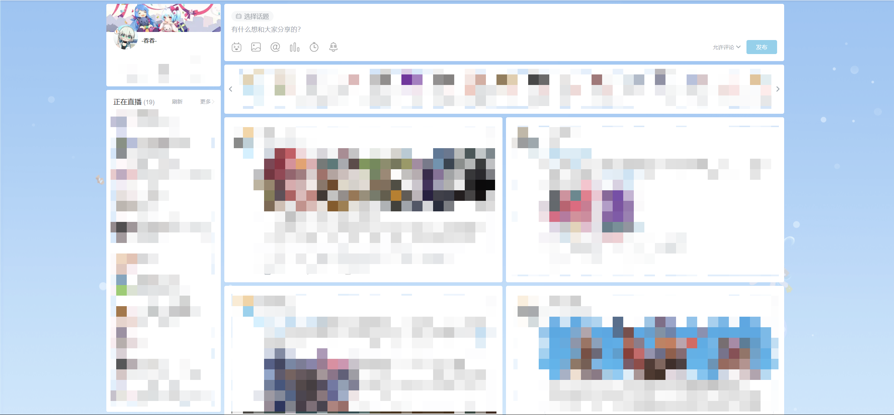

# 主站功能

## 动态首页

### 动态双列展示

移除右侧公告栏和话题，将bilibili动态首页改为双列布局，提高浏览效率。

:::tip
该功能默认关闭，想要开启此功能需要访问插件选项页，在主站设置中开启**是否开启动态首页双列展示**
:::

### 正在直播列表拓展

左侧正在直播列表原版最多显示10个，想查看更多内容需点击更多，不方便浏览。

本功能开启后会取代原本的正在直播列表，将所有正在直播的up信息都进行展示，并支持滚动（效果见上图）。

并且支持随时刷新列表，只需点击刷新按钮(刷新按钮偶尔会消失，刷新网页即可)。

:::tip
该功能默认关闭，想要开启此功能需要访问插件选项页，在主站设置中开启**是否开启【正在直播】列表加强版**
:::

### 暗黑模式

拓展支持开启动态首页的暗黑模式(暗黑模式目前仍在逐渐改进，如果有专业UI有更好的配色方案并有意向一同改进本插件，请联系我)

:::tip
该功能默认关闭，想要开启此功能需要访问插件选项页，在主站设置中开启**是否开启动态首页暗黑模式**
:::

### 动态截图

动态首页的动态右上角弹出菜单，增加动态截图按钮；点击可快速截取当前动态的内容并自动复制到剪切板

:::caution
该功能目前存在无法复制动态中的icon图标问题
:::