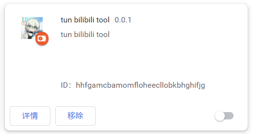

# 从仓库releases安装

仓库releases地址：[bilibili-tool-mv3 releases](https://github.com/tuntun0609/bilibil-tool-mv3/releases)

## 下载安装包

打开上述仓库releases地址，点击最新的版本的zip文件进行下载，下载后解压至任意文件夹。

## 安装插件

1. 打开chrome浏览器，在右上角会找到三个点的按钮，点击按钮后依次点击：更多工具->拓展程序，进入拓展管理页面；或者直接在浏览器地址栏输入`chrome://extensions/`并回车访问拓展管理页面。

2. 在右上角打开开发者模式：

3. 此时可以看到出现三个按钮，点击加载**已解压的拓展程序**

4. 之后在打开的文件夹选择器中选择上一步解压的文件夹。之后拓展管理页会出现如图：

:::note
如果右下角未启用，则点击右下角启用即可。
:::
