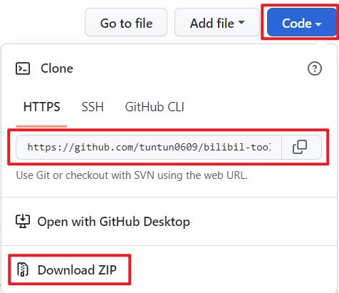
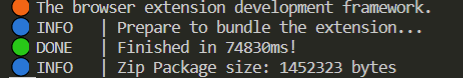
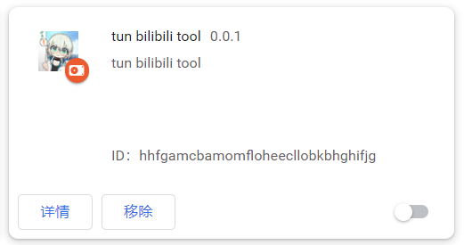

# 从源码安装

仓库地址：[bilibili-tool-mv3](https://github.com/tuntun0609/bilibil-tool-mv3)

## 下载源码

在仓库页可以找到如下内容，点击Code，之后选择下载源码zip文件或者通过git下载源码。

## 安装项目依赖

下载之后解压或者打开源码的文件夹，打开任意命令行工具并将路径指向源码所在文件夹。

运行命令`npm install`或者`pnpm install`

:::tip
运行该命令需要安装node或者pnpm；node官网：[node](https://nodejs.org/zh-cn/)，是否使用pnpm请自行决断

上述安装过程如果报错请再次重复，直到不报错为止。
:::

## 编译项目

安装完成后运行`npm run build`或`pnpm run build`；等待编译完成，编译完成后提示如下：

## 安装插件

编译完成之后会在`build`文件夹下找到`chrome-mv3-prod`文件夹和`chrome-mv3-prod.zip`压缩包。

1. 打开chrome浏览器，在右上角会找到三个点的按钮，点击按钮后依次点击：更多工具->拓展程序，进入拓展管理页面；或者直接在浏览器地址栏输入`chrome://extensions/`并回车访问拓展管理页面。

2. 在右上角打开开发者模式：

3. 此时可以看到出现三个按钮，点击加载**已解压的拓展程序**

4. 之后在打开的文件夹选择器中选择上一步生成的`chrome-mv3-prod`文件夹。之后拓展管理页会出现如图：

:::note
如果右下角未启用，则点击右下角启用即可。
:::